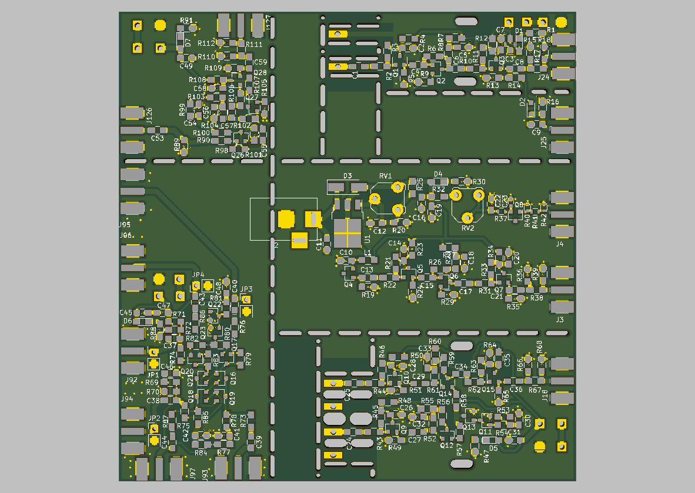

This is a pack of RF circuits all laid out onto the same PCB.  They use the UHF transistor 2SC3356 with 7 GHz transition frequency.  There are five circuits: an Active RF probe, a Active RF Differential Probe, series and shunt noises generator, a Gilbert cell mixer, and a RF amplifier.

These designs are by D. Marks KW4TI and are distributed under the Creative Commons Shared Alike Attribution (CC-BY-SA 4.0) license.

